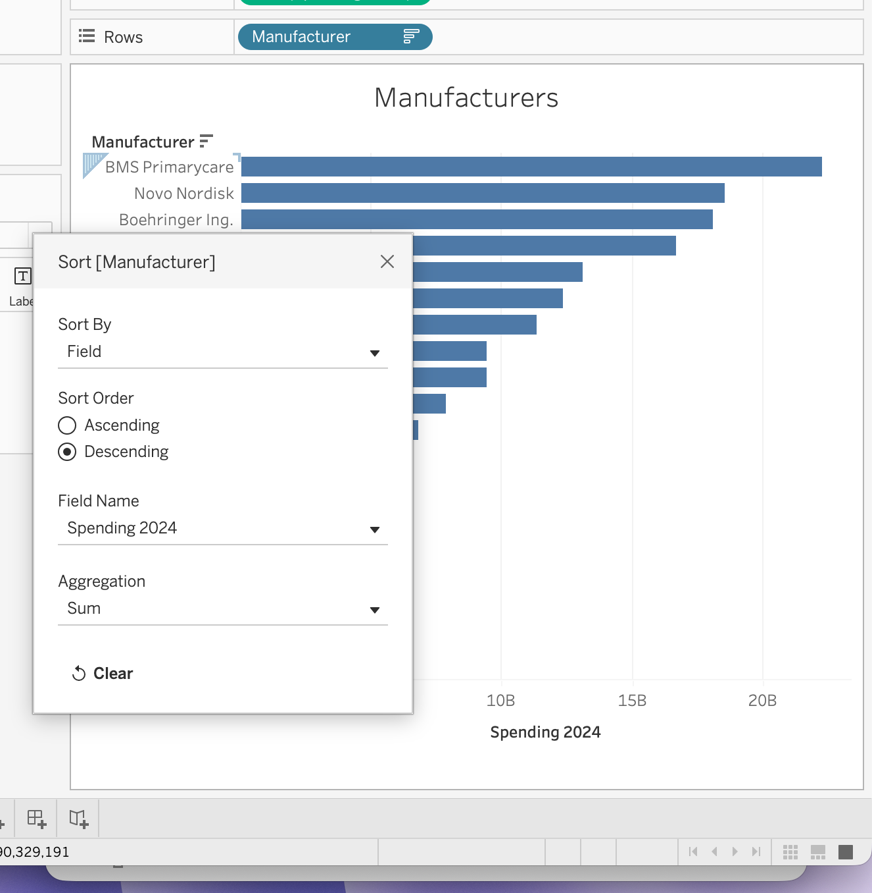
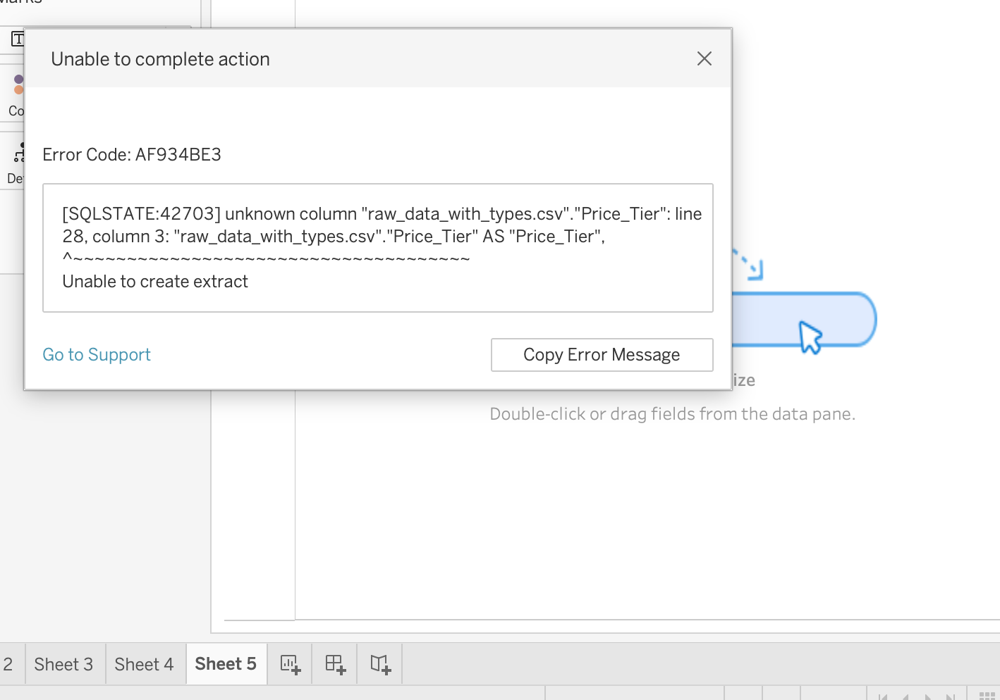

# Medicare Claims Analytics Platform

End-to-end healthcare analytics project using PostgreSQL, SQL, and Tableau to analyze the CMS DE-SynPUF Medicare claims dataset. The project includes data preparation, SQL analysis, and interactive dashboards focused on utilization, provider performance, diagnosis costs, and Medicare spending.



---

# Project Overview

This project analyzes more than 845,000 Medicare inpatient and outpatient claims from the CMS DE-SynPUF dataset. A PostgreSQL database was built from the raw files, followed by SQL analyses and Tableau dashboards designed to summarize utilization trends, provider performance, chronic disease prevalence, and Medicare reimbursement patterns.

---

# Objectives

- Analyze inpatient and outpatient utilization
- Identify high-cost diagnoses
- Evaluate provider performance
- Examine Medicare payment trends
- Develop executive and operational dashboards

---

# Dataset

**Source:** CMS DE-SynPUF (Centers for Medicare & Medicaid Services)

The CMS DE-SynPUF dataset is a publicly available synthetic Medicare claims dataset developed for research, education, and analytics while preserving patient privacy.

Data used includes:

- Beneficiary demographics
- Inpatient claims
- Outpatient claims
- Chronic condition indicators
- Medicare payment information

---

# Technology Stack

| Technology | Purpose |
|------------|---------|
| PostgreSQL | Database |
| SQL | Data preparation and analysis |
| Tableau Public | Dashboard development |
| Git | Version control |
| GitHub | Project hosting |

---

# SQL Analysis

The SQL portion of the project includes:

- Data validation
- Data cleaning
- Beneficiary analysis
- Inpatient analysis
- Outpatient analysis
- Provider performance
- Payment analysis
- Chronic condition analysis
- Population health analysis
- Dashboard export queries

SQL concepts used include:

- INNER JOIN
- LEFT JOIN
- Common Table Expressions (CTEs)
- Window Functions
- CASE statements
- Aggregate functions
- GROUP BY
- HAVING
- ORDER BY

---

# Tableau Dashboards

## Dashboard 1 — Executive Summary


The executive dashboard summarizes Medicare utilization and payment trends, including:

- Executive KPI summary
- Annual Medicare payments
- Year-over-year outpatient claims
- Most common diagnosis codes
- Chronic condition prevalence

Tableau Public:

https://public.tableau.com/app/profile/savannah.wilcox4290/viz/MedicareClaimsUtilizationPaymentAnalysisDB1/Dashboard1?publish=yes

---

## Dashboard 2 — Provider Performance & Cost Drivers



The provider dashboard focuses on operational and financial performance, including:

- Provider Performance Matrix
- Top providers by Medicare spending
- Highest average payment by diagnosis
- Diagnosis spending analysis

Tableau Public:

https://public.tableau.com/app/profile/savannah.wilcox4290/viz/MedicareClaimsUtilizationPaymentAnalysisDB2/ProviderPerformanceCostDrivers?publish=yes

---

# Key Findings

- Outpatient claims substantially exceeded inpatient claims during the study period.
- A relatively small number of providers accounted for a large share of Medicare reimbursement.
- Several diagnosis codes had high average payments despite relatively low claim volumes.
- Diabetes and ischemic heart disease were among the most prevalent chronic conditions in the beneficiary population.
- Medicare spending varied across provider organizations and diagnosis categories.

---

# Repository Structure

```text
healthcare-claims-sql-analysis/
├── data/
├── database/
├── documentation/
├── outputs/
├── queries/
├── tableau/
└── README.md
```

---

# Skills Demonstrated

- Healthcare analytics
- SQL
- PostgreSQL
- Relational database design
- Data validation and cleaning
- Exploratory data analysis
- Tableau dashboard development
- Data visualization
- Git
- GitHub

---

# Future Enhancements

- Predictive modeling for readmission risk
- Provider benchmarking
- Automated reporting pipeline
- Additional operational dashboards

---

# Author

Savannah Wilcox

Healthcare Management Student  
SQL • PostgreSQL • Tableau • Healthcare Analytics
