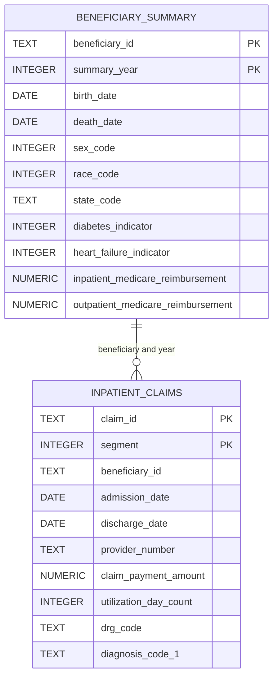

# Medicare Claims Analytics with PostgreSQL and Tableau

## Project Overview

This project analyzes CMS synthetic Medicare beneficiary and claims data using PostgreSQL. It demonstrates how raw healthcare data can be organized, cleaned, validated, joined, and analyzed using a relational database.

The current analysis focuses on beneficiary demographics, chronic conditions, inpatient utilization, claim payments, length of stay, diagnosis codes, DRG codes, and provider claim volume.

The dataset contains synthetic records and does not represent actual Medicare beneficiaries. Results are intended to demonstrate SQL and healthcare analytics skills rather than make conclusions about the real Medicare population.

## Project Objectives

The objectives of this project are to:

* Design a relational database for healthcare claims analysis.
* Import raw CMS CSV files into PostgreSQL staging tables.
* Convert raw text fields into appropriate data types.
* Validate row counts, missing values, and date fields.
* Analyze beneficiary demographics and chronic conditions.
* Evaluate inpatient utilization and payment patterns.
* Join beneficiary and inpatient claims data correctly.
* Build a Tableau dashboard summarizing the final findings.
* Document the database using an entity relationship diagram and data dictionary.

## Dataset

This project uses the CMS Medicare Claims Synthetic Public Use Files.

The files currently included in the project workflow are:

* 2008 Beneficiary Summary
* 2009 Beneficiary Summary
* 2010 Beneficiary Summary
* 2008–2010 Inpatient Claims
* 2008–2010 Outpatient Claims

The raw CSV files are excluded from GitHub because of their size. Instructions and SQL scripts are included so the database can be recreated using the original CMS files.

## Tools

* PostgreSQL
* SQL
* Tableau Public
* Git and GitHub
* Nano and Visual Studio Code
* CMS Synthetic Medicare Claims Data

## Project Workflow


## Database Design

The project currently contains two completed analytical tables:

### `beneficiary_summary`

Contains annual beneficiary information, including:

* Beneficiary identifier
* Summary year
* Birth and death dates
* Sex and race codes
* Geographic codes
* Insurance coverage months
* Chronic-condition indicators
* Medicare reimbursement amounts
* Beneficiary responsibility amounts

The table uses a composite primary key consisting of:

```text
beneficiary_id + summary_year
```

This is necessary because the same beneficiary can appear in multiple years.

### `inpatient_claims`

Contains inpatient claim information, including:

* Claim identifier
* Beneficiary identifier
* Claim and admission dates
* Provider number
* Medicare claim payment
* Length of stay
* DRG code
* Diagnosis codes
* Procedure codes

The table uses a composite primary key consisting of:

```text
claim_id + segment
```

## Entity Relationship Diagram



The final ERD will also include the outpatient claims table.

## SQL Skills Demonstrated

The project currently demonstrates:

* `SELECT`
* `WHERE`
* `COUNT`
* `COUNT DISTINCT`
* `AVG`
* `SUM`
* `ROUND`
* `GROUP BY`
* `HAVING`
* `ORDER BY`
* `LIMIT`
* `CASE`
* `CAST`
* `FILTER`
* `UNION ALL`
* Subqueries
* `INNER JOIN`
* `LEFT JOIN`
* Date functions
* Composite primary keys
* Raw staging tables
* Data validation queries

## Analysis Completed

### Beneficiary Overview

The dataset contains:

* 343,644 beneficiary-year records
* 116,352 unique synthetic beneficiaries
* 112,754 beneficiaries represented in all three years

### Demographics

Beneficiary-year records were:

* 55.3% female
* 44.7% male
* 82.8% White
* 10.6% Black
* 4.2% Other
* 2.4% Hispanic

The average beneficiary age increased from 71.6 years in 2008 to 73.6 years in 2010, which is consistent with following many of the same beneficiaries over time.

### Chronic Conditions

The most frequently identified chronic conditions were:

| Condition              | Prevalence |
| ---------------------- | ---------: |
| Ischemic heart disease |      42.4% |
| Diabetes               |      36.3% |
| Heart failure          |      29.6% |
| Depression             |      21.2% |
| Chronic kidney disease |      16.9% |
| COPD                   |      12.7% |

These percentages describe beneficiary-year records in synthetic data.

### Inpatient Claims

The inpatient file contains 66,773 claims.

The analysis includes:

* Claim volume by year
* Average claim payment
* Average length of stay
* Most common DRG codes
* Most common diagnosis codes
* Highest-volume providers
* Highest-paid claims

A small number of hospital stays began in late 2007 and ended in 2008. These claims were retained because they represent valid cross-year hospital stays. However, 2007 is treated as partial-year data and is not directly compared with the complete study years.

### Join Analysis

Beneficiary demographics and inpatient claims were joined using:

```text
beneficiary_id + admission year
```

Including the year prevents one claim from matching multiple annual beneficiary records.

The join analysis found:

* Under-65 beneficiaries had an average inpatient stay of 5.70 days.
* Beneficiaries age 65–74 had an average stay of 5.49 days.
* Beneficiary-year records with diabetes had an average stay of 5.63 days.
* Records without diabetes had an average stay of 5.33 days.

These results show associations within the synthetic dataset and do not establish causation.

The join validation also identified 226 unmatched inpatient claims. These were partial-year 2007 admissions without corresponding 2007 beneficiary-summary records.

## Repository Structure

```text
healthcare-claims-sql-analysis/
├── README.md
├── .gitignore
├── data/
│   ├── raw/
│   └── processed/
├── database/
│   ├── beneficiary/
│   ├── inpatient/
│   └── outpatient/
├── queries/
│   ├── 01_basic_exploration.sql
│   ├── 02_beneficiary_demographics.sql
│   ├── 03_chronic_conditions.sql
│   ├── 04_inpatient_analysis.sql
│   └── 05_joins.sql
├── documentation/
│   ├── diagrams/
│   ├── screenshots/
│   └── data_dictionary/
├── outputs/
└── tableau/
```

## Current Project Status

Completed:

* Beneficiary staging table
* Beneficiary clean table
* Beneficiary validation
* Demographic analysis
* Chronic-condition analysis
* Inpatient staging table
* Inpatient clean table
* Inpatient validation
* Inpatient analysis
* Beneficiary and inpatient joins
* Initial ERD
* Initial workflow documentation

In progress:

* Outpatient claims database
* Outpatient claims analysis
* Final ERD
* Data dictionary
* Advanced SQL analysis
* Tableau dashboard
* Final findings and recommendations

## Limitations

* The data is synthetic and does not represent actual beneficiaries.
* Results should not be generalized to the real Medicare population.
* Diagnosis and procedure codes are not currently joined to descriptive lookup tables.
* The 2007 inpatient records represent partial-year data.
* Chronic-condition prevalence is based on beneficiary-year records rather than unique beneficiaries.
* The outpatient analysis and Tableau dashboard are still in development.

## Planned Enhancements

The remaining project work will include:

* Importing and cleaning outpatient claims
* Comparing inpatient and outpatient utilization
* Creating additional joins
* Adding common table expressions and window functions
* Building a complete data dictionary
* Finalizing the ERD
* Creating a Tableau dashboard
* Adding dashboard screenshots and final conclusions

